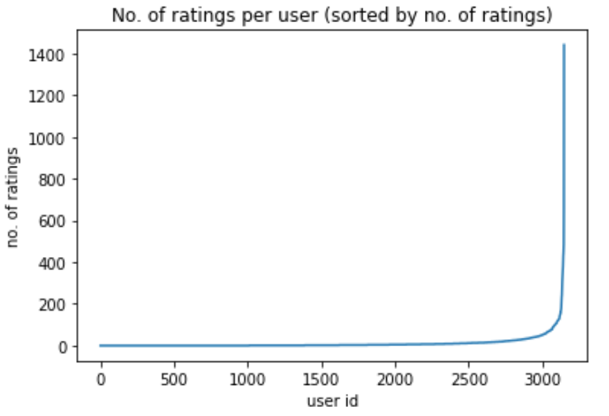
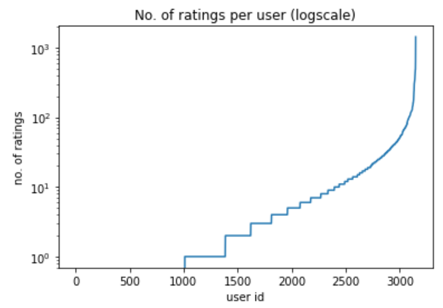
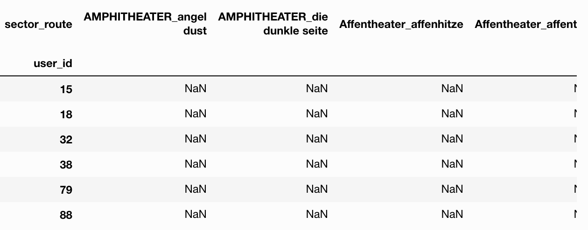
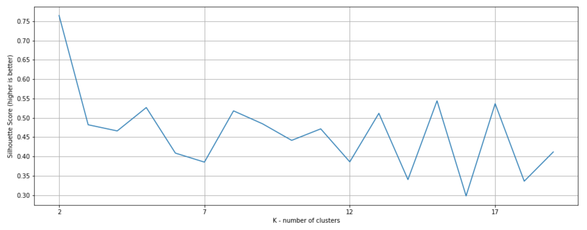
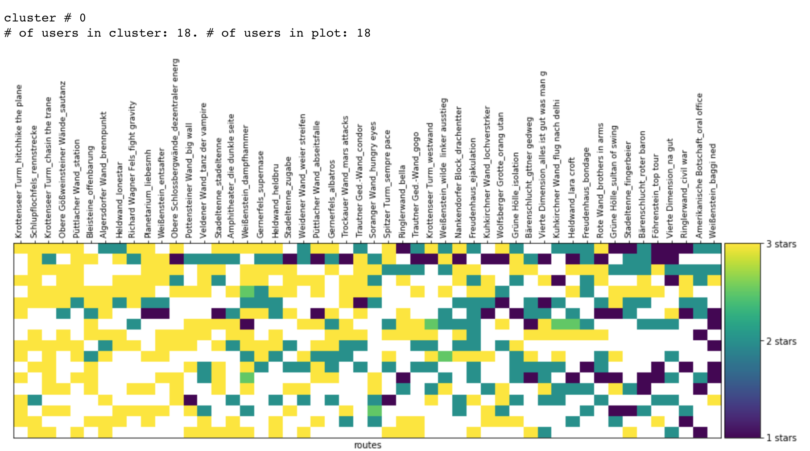
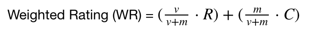
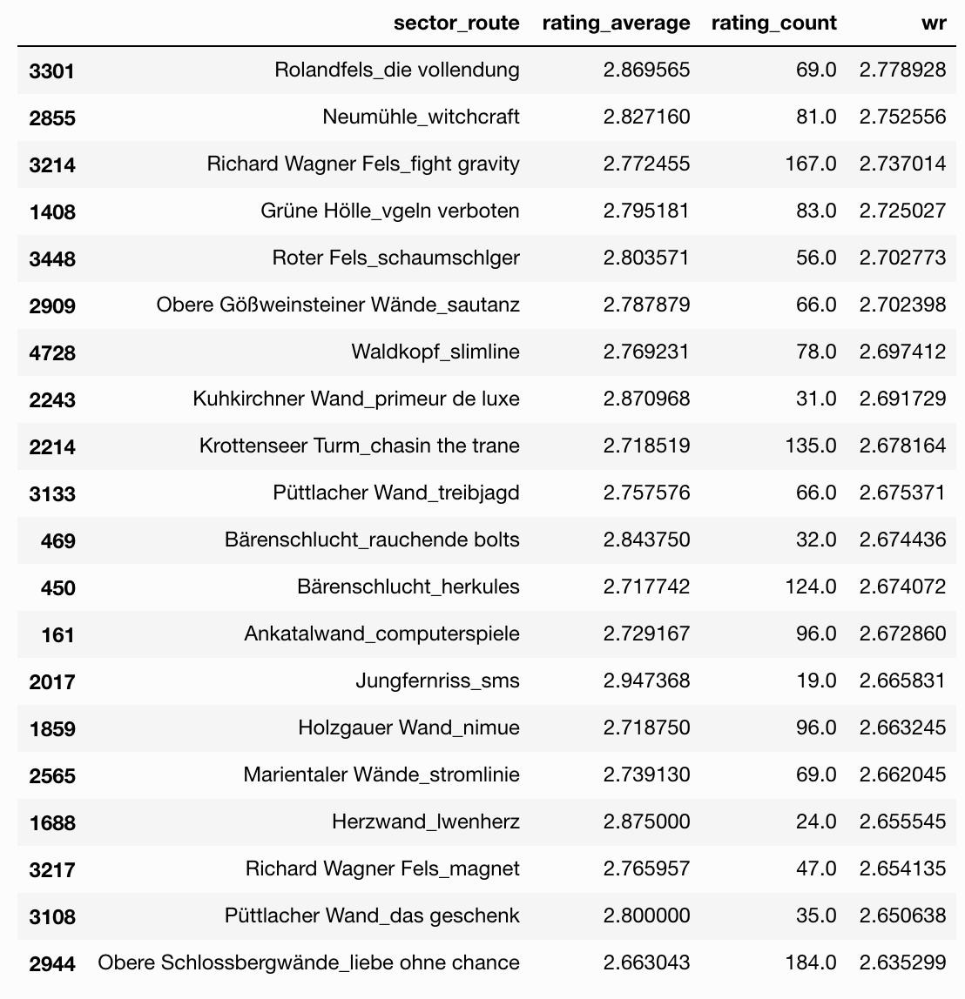
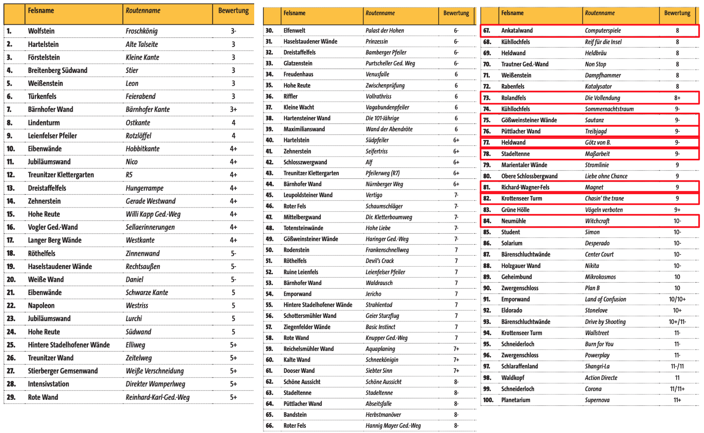
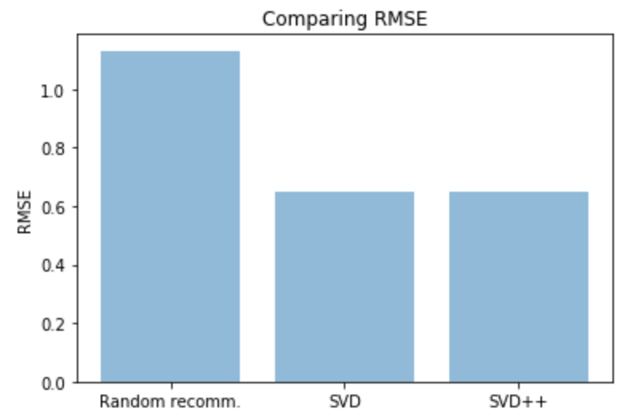

# Machine Learning Engineer Nanodegree
## Capstone Project
Dominik Lindenberger  
November, 2018

## I. Definition

### Project Overview
The goal of this project is to build a recommender system for climbing routes within a given climbing area. The system will take a climber's preference into consideration.

My Capstone Project is located in the world of **rock climbing**.  
>_Rock climbing is an activity in which participants climb up, down or across natural rock formations or artificial rock walls. The goal is to reach the summit of a formation or the endpoint of a pre-defined route without falling._ [^first]  

Here is a video of a rock climber on a famous route called [Action Directe](https://www.youtube.com/watch?v=y3EJctYJzpk).

In recent years rock climbing has gained a lot of traction and is becoming more popular as an outdoor sports for a larger number of people. As such, there exists a potentially large audience  who could be interested in this project.

Unlike the climber from the video above most people do rock climbing as a leisure activity. Therefore, time they can spend to go climbing is limited. As a hobby climber planning a climbing trip it is quite common to have a time window of round about 1-3 weeks at the climbing destination of choice. The majority of climbing areas boast a large number of routes to climb, far greater than anyone can achieve within a single trip. For example, the climbing area 'Frankenjura', one of Germany's largest climbing area, contains more than 10,000 climbs. It is therefore in the interest of the climber to know and attempt those climbs that are most enjoyable to her or him and just skip the rest.

Often times there is a common agreement on what are the 'best' routes in a certain area and they are common knowledge. Most guide books contain some sort of list of the "Top climbs" in that region.    
However, climbers often differ in their personal preferences. Some prefer to climb on small crimpy holds, while others enjoy long dynamic movements on large holds.  
Additionally, for some type of rock, the climbs deteriorate over time as heavy traffic 'polishes' holds with formerly good and important friction.  

Therefore, climbers would benefit from a personal recommendation of the best climbs within a climbing area, that match their climbing level as well as their personal preference.

Meanwhile there are many websites where climbers can track their climbs and ascents in a virtual logbook and also rate the quality of the route. Most famous websites of this kind are

* [8a.nu](https://www.8a.nu/)
* [theCrag.com](https://www.thecrag.com/)
* [UKClimbing.com](https://www.ukclimbing.com/logbook/)

With this project, I will explore the database of 8a.nu - published on [Kaggle](https://www.kaggle.com/dcohen21/8anu-climbing-logbook) - to establish a personal recommendation system for climbers venturing into new climbing areas.  

There has been quite a lot of academic research on the topic of recommender systems as well. Here is a short excerpt of publications:

* Su and Khoshgoftaar provide a good introduction into CF in their article [A Survey of Collaborative Filtering Techniques](https://www.hindawi.com/journals/aai/2009/421425/)
* In their 2018 paper Christakopoulou and Karypis provide an overview of [Local Latent Space Models for Top-N Recommendation](http://glaros.dtc.umn.edu/gkhome/node/1225)

As I am an avid climber myself, this project is something I take a strong personal interest in.

[^first]: [What is Rock Climbing?](https://riverrockclimbing.com/new-climbers/what-is-rock-climbing/)

### Problem Statement

The structure of the problem is that of a **Ranking problem** or more precise a **Collaborative Filtering problem**, where we try to suggest climbs based on a climber's similarity to other climbers.  

We will try to measure similarity based on ratings given to a climbed route. Climbers who climbed the same routes and gave those routes similar ratings, might also agree in their opinion on routes they haven't climbed, yet.  

So, we'll try to cluster climbers that climbed similar routes and that gave similar ratings to those routes using K-Means. This is an *Unsupervised Learning* technique.

Once we have identified clusters of climbers with similar taste, we'll determine a cluster's most recommended routes based on ratings and number of ratings. This is a **user based collaborative filtering** technique. 

In order to give a climber a personal recommendation, we have to determine to which cluster he or she belongs and recommend the **top n routes** from the cluster's top recommended routes that he or she has not climbed yet.

Our anticipated solution will be:  
**For any given climber, we can provide a personal recommendation of *n* routes that he or she has not climbed before.**

The following tasks should get us there:  

1. Consolidation of climbing routes (major cleanup/prep work, because users make typos in route names which result in duplicate routes in the data set)
- Match climbers' recommendations with routes  
- Determine cluster size using *Silhouette Score*  
- Cluster climbers based on recommendations using *K-Means*.  
- Calculate *Weighted Rating* of every route for climber's cluster to receive an absolute ranking of all routes.  
- Recommend top *n* routes that climber has not climbed before.  


### Metrics

Basically, our problem is a ranking problem. We want to show the most attractive and suitable climbs to a user. However, we'll frame it as a rating prediction problem.  
Using different models we will predict ratings of so far unrated routes. For this purpose we will use **RMSE** (Root Mean Squared Error) as our evaluation metric.

The project model as well as all of the benchmark models can be evaluated using RMSE, thus making this metric the favorable choice.


## II. Analysis

### Data Exploration

The data set for this project was downloaded from Kaggle at  
[8anu climbing logbook](https://www.kaggle.com/dcohen21/8anu-climbing-logbook)

Here is an overview of the data contained in the data set.

| Column | Description | Datatype | Use | 
|:------ |:------ |:------:|:------:| 
| `crag_country` | 3-letter country code of the country where the crag is located. | categorical | no | 
| `crag_id` | Unique id for identifying each crag. | int | no | 
| `crag` | Name of the crag | text | no | 
| `sector_id` | Unique id for identifying each sector. | int | yes | 
| `sector` | Name of the sector. A sector is a specific area within a crag. | text | yes | 
| `route` | Name of the route the climber has climbed. | text | yes | 
| `grade_id` | Unique id for identifying each climbing grade. | int | statistics | 
| `grade` | Climbing grade given to that route as per the French grading system | categorical | statistics | 
| `year` | Year the route was climbed | int | statistics | 
| `date` | Date the route was climbed. The date format is number of seconds since 1970-01-01. | int | statistics | 
| `method_id` | Unique id for identifying each type of ascent. | int | statistics | 
| `method` | The type of ascent the climber made on that route. | categorical | statistics | 
| `notes` | Additional information the climber provided for this climb, e.g. Soft graded, i.e. fairly easy climb for the given grade | categorical | statistics | 
| `raw_notes` | Encoding of different notes and combination of notes | int | statistics | 
| `rating` | Rating given to the climb by this climber. This is our target attribute. | int | target | 
| `user_id` | Unique id for this climber. | int | yes | 
| `user_country` | 3-letter country code of the country where this climber is from. | categorical | statistics | 
| `user_city` | City where this climber is from | text | statistics | 
| `sex` | The climber's sex. 0 indicates male, 1 indicates female. | int | statistics | 
| `height` | The climber's height in cm | int | statistics | 
| `weight` | The climber's weight in kg | int | statistics | 
| `birthdate` | The climber's date of birth | date | statistics | 
| `started_climbing` | The year the climber started climbing. | int | statistics | 

In the table above the column `Use` indicated how we plan to use the given column.

- `target` - this is a target attribute.
- `yes` - this column will be used during exploration and analysis.
- `no` - not planned to use that column during analysis and exploration.
- `statistics` - this column will not be used for analysis but may be interesting later on to do user statistics etc.

Our dataset contains __114,587 logged climbs__. 60,303 out of these contain a rating. That is approx. 52.63%.


#### Missing values

Let us take a look if we have **missing values** or **zero values**.

Number of missing values per column:

```
id           0
sector_id    0
sector       0
route        0
rating       0
user_id      0
dtype: int64
```
This means there are no entries missing in the columns that we look at.

Number of zero values per column:

```
id               0
sector_id    12301
sector           0
route            0
rating       48291
user_id          0
dtype: int64
```
However, there a quite a significant amount of sector_IDs missing and also a lot of ratings.

#### Unique values
A naive calculation on the number of unique sectors and routes within these sectors. Submitted by a number of distinct users.

```
sector_id      350
route        12471
user_id       3292
dtype: int64
```
Why do we call the above estimate _naive_? 

According to [climb-europe.com](http://www.climb-europe.com/RockClimbingGermany/RockClimbingFrankenjura.html) _"there are approximately 1,000 crags spread out in a beautiful forest terrain"_ (Note that _crags_ in the above quote is the same as _sectors_ in our dataset.) This seems fine since in our dataset there are 351 different sectors noted.

However, let's look closer here. What are the records where `sector_id` is 0?  
We take a look at a number of samples.


So, what we can see is, that `sector_id == 0` actually does not belong to a proper sector, but rather denotes that sector is not known in this case. Later we'll have to remove those entries.

In the article it continues to claim that _Frankenjura boasts in excess of 10,000 routes._ Now this is where we should get a little suspicious. In only 350 sectors our dataset apparently contains already more than 12,000 routes - which is well above the 10,000 mentioned in the article.

Lets dig deeper here. Maybe there are a number of duplicates in the registered routes. Let's see if an example can confirm this.

```
df[df['route'].str.startswith('knack')].drop_duplicates(subset=['route'])['route']
```
Output:

```
108084       knack  back
101251    knack und back
38966     knack and back
Name: route, dtype: object
```
We will have to consolidate those duplicates during Preprocessing.


### Exploratory Visualization

#### Missing values

Lets visualize the **Missing** and **Zero values** per column.


In our data set `0` is in indicator for missing values, except for `sex` where `0` indicates `male` (and `1` for `female`).

From the graph above we can conclude that we have missing data in `sector_id` and `rating`.

Since `sector_id` and `rating` are important for our analysis, we have to consider what to do about those missing values during Data Preparation later on.

#### Analysis of our target variable `rating`


From the distribution of the target variable `rating`, we can see that there are four distinct values. With 52.7% of ratings equal to 0, only about half of the ascents have been rated.

In the climbing community it is commonplace to rate only good climbs by marking them with a star. Thus, the values `1`, `2` or `3` correspond to one, two or three stars. Where one star is a good route and three stars is an exceptionally good climb.

Hence the value `0`, or zero stars, denotes that a climb was either not rated or was not worth a star according to that user.

Approximately 2/3 of the users have rated at least one item, i.e. gave a rating of 1, 2 or 3.

Let's take a look at how many ratings users typically gave.



From the above plot we can see that there must be one or several outliers with a large number of ratings (around 1600). Let's apply the logarithm on the y-axis to get a better picture.



Now, this has more information. We can see that approx. 30% of users gave no rating at all. And more than 99% of users gave less than 200 ratings.

Let's look at the percentiles information in detail to confirm this.

```
count    3292.000000
mean       13.177400
std        49.680102
min         0.000000
25%         0.000000
33%         1.000000
50%         2.000000
75%         9.000000
90%        29.000000
95%        53.000000
99%       153.270000
max      1665.000000
Name: rating, dtype: float64
```

### Algorithms and Techniques

Our problem is a _Collaborative Filtering_ problem. As such, this problem lends itself to exploring data with **K-Means** algorithm and try to find natural clusters of climbers. Our main parameter for K-Means is the number of clusters.

The _Silhouette Score_ is a suitable way to find out the number of clusters we should aim for using K-Means. Through K-Means we hope to achieve a clustering of climbers based on their similarity. Climbers within the same cluster should then have a high probability of giving high ratings to the same routes.

### Benchmark

As a benchmark we'll use a __random recommender__, i.e. for a given user, any route will be given a random rating from 1, 2 or 3 stars. This will be our quantitative measurement to compare against. Results for this benchmark (RMSE) will be obtained during implementation as data pre-processing is required before.  
For a __qualitative benchmark__, we'll compare results to the recommendations by climbing magazine _klettern.de_.

## III. Methodology

### Data Preprocessing

As a first preprocessing step we'll remove all entries where `sector_id == 0`. We have established earlier, that here the actual sector is not known, thus the entry is not usable.

Now we'll have to tackle route name consolidation. As identified earlier during _Data Exploration_ there are many duplicate routes. Since route names are per sector, we can reduce processing amount by consolidating route names within each sector.

The following steps will take us to a consolidated list of routes:  

- Transform all route names to lowercase and remove special characters (`string_cleaning(df, columns)`)
- Find similar route names by applying _Jaro Winkler Distance_ on the route names.  
- Pick the most used route name as the route name of choice
- Do this for all sectors

Eventually, we only have to get unique values for all `sector_route` names to arrive at a list of unique routes. After the consolidation our new count for routes is __6754__, which is a lot less than what our naive count was and seems a lot more reasonable.

Luckily, getting a unique list of users is easy, by just applying `.drop_duplicates()` on `user_id`.

Finally, we'll also get a list of unique ratings, by excluding `rating == 0` values as this is the same as _not rated_.


### Implementation

 As outlined earlier, we want to apply K-Means to find clusters of similar users. The first step in that process is _pairing_ the list of routes with the list of user ratings using `pd.pivot_table(df_ratings, index='user_id', columns= 'sector_route', values='rating')`.
 
 The results look like this:
 
 
 
 The many `NaN` values are an indicator for how sparse this matrix is - which is typical for user rating matrices.
 
 Before going into clustering, we have to transform our matrix into a real sparse matrix, using `to_coo()`.
 
 Another useful precursor for clustering with K-Means is finding out how many clusters we should aim to find. The __Silhoutte score__ will help us out here. The corresponding silhoutte score in our case looks as following:
 
 
 
 According to the diagram the best number of clusters is 2. This is not really the answer we were hoping for. If there are only two clusters, then our assumption of grouping similar users into clusters seems not to hold as apparently there are not a lot of dividing characteristics among users. However, let's explore further before taking a decision.
 
 Knowing the number of clusters, producing the clustering is a simple one liner  
 `predictions = KMeans(n_clusters=2, algorithm='full').fit_predict(sparse_ratings)`
 
 As the result of K-Means' `fit_predict` is an `ndarray` we have to add this as a new column to our dataframe to make use of it.

```
clustered = pd.concat([user_route_ratings.reset_index(),
                      pd.DataFrame({'group': predictions})], axis=1) 
```

Let's see how the actual numbers look like for number of users within each cluster.

```
1    2121
0      18
Name: group, dtype: int64
```
These numbers confirm our suspicion that the clustering has not brought the diversivication of users that we had hoped for.

Let's look at a visualization of the resulting clusters regardless.



The routes are sorted by most rated and best rated from left to right. Each square represents the rating of one user.

#### Prediction - First attempt

In order to get our __prediction__ of recommended routes for a single user, we will do the following for each user:

1. Determine to which cluster a user belongs
1. Calculate average rating of each route within cluster and sort routes accordingly
1. Recommend the top n routes based on our calculated average that user has not climbed, yet.

##### 1 - Cluster membership
The function `cluster_membership(clustered, user_id)` is a simple lookup in the `clustered` dataframe and yield the user's `cluster_id`.

##### 2 - Average rating per route
To calculate a route's average rating within a cluster we'll use the following _Weighted Rating_ formula:  



where  

- *v* is the number of ratings for that route
- *m* is the minimum ratings required to be listed in the chart
- *R* is the average rating of the route
- *C* is the mean vote across the whole report

This formula makes sure that the number of ratings is being considered and avoids the problem of a route with a single three star rating ending up at the top of our list.

##### 3 - Top n routes per climber

The function `top_n_routes_cluster(cluster, n=0)` returns the top n routes of a given cluster sorted by the Weighted Rating formula described above.

The functiuon `top_n_routes_user(clustered, user_id, n)` uses the results of `top_n_routes_cluster(cluster, n=0)` to determine a user's top n routes, i.e. the routes a user has climbed already are excluded from this list.

#### Qualitative result check

For a qualitative result check, let's look at the top 20 recommended routes within a cluster and count how many of the routes show up in the Top 100 list of climbing magazine _klettern_. The list is available on the [klettern.de](https://www.klettern.de/sixcms/media.php/8/Top100-Kletterrouten_Frankenjura.pdf) website.

We retrieve the top 20 routes of cluster 0 using
```top_n_routes_cluster(cluster, 20)```

And the result looks as following, sorted by weighted rating:



We find 9 out of 20 recommended routes also in the Top 100 list of klettern.de. So, our recommendations seem to be going the right direction.



The suggested routes are all in the upper experienced to expert level. Which is no surprise, as we have seen earlier, that the majority of climbed routes is from that range.

We still need to tackle the problem of the few clusters. With only two clusters of users and more than 90% of users in one cluster, we can hardly provide personalised recommendations.

### Alternative Implementation - SVD

Let's try a __Matrix Factorization based algorithm__ for an alternative. The [Surprise package](http://surpriselib.com/) implements __SVD__, an algorithm that became popular for winning the 1M$ Netflix prize.

We can use our cleaned ratings input also in combination with SVD. Training the SVD on our data is as simple as creating an algorithm object with `SVD()` and calling `cross_validate()` on our rating data.

```
svd = SVD()
_ = cross_validate(svd, data, measures=['RMSE'], cv=5, verbose=True)
```

The output is measured using the _Root Mean Squared Error_.

```
Evaluating RMSE of algorithm SVD on 5 split(s).

                  Fold 1  Fold 2  Fold 3  Fold 4  Fold 5  Mean    Std     
RMSE (testset)    0.6527  0.6515  0.6457  0.6533  0.6519  0.6510  0.0027  
Fit time          2.16    2.15    2.12    1.88    1.88    2.04    0.13    
Test time         0.07    0.06    0.06    0.06    0.06    0.06    0.00    
```
In our case we get a `RMSE = 0.6510` on a 5-fold cross validation run.

For example user `user_id = 5512` the top 10 recommended routes are

```
[('Bleisteine_offenbarung', 2.477913536224587),
 ('Neumühle_witchcraft', 2.4578274392648605),
 ('Weidlwanger Wand_the dance alone', 2.4490098743900375),
 ('Ankatalwand_computerspiele', 2.4468467744030757),
 ('Moritzer Turm_high gravity day', 2.431914905737715),
 ('Heldwand_gtz von b', 2.3965405132721855),
 ('Bärenschlucht_brentter', 2.3780055666037585),
 ('Student_simon', 2.3712190426118784),
 ('Kuhkirchner Wand_primeur de luxe', 2.3456612739659577),
 ('Roter Fels_schaumschlger', 2.3223257808653144)]
```

In our qualitative check against the klettern.de top list, we can find again 50% of the routes recommended by our personal recommender. This, confirms that also our new recommender suggests routes which are among the best in the area.

### Refinement

In order to refine results of the SVD algorithm, we're executing a grid search on the parameters:

- `n_epochs` - The number of iteration of the SGD procedure.
- `lr_all` - The learning rate for all parameters.
- `reg_all` - The regularization term for all parameters.

The best results were achieved testing for RMSE by


```
0.6530371431723033
{'n_epochs': 15, 'lr_all': 0.007, 'reg_all': 0.2}
```
Re-running the model with updated parameters from grid search yields a slightly improved mean `RMSE = 0.6489` (previous result was `RMSE = 0.6510`.

```
Evaluating RMSE of algorithm SVD on 5 split(s).

                  Fold 1  Fold 2  Fold 3  Fold 4  Fold 5  Mean    Std     
RMSE (testset)    0.6480  0.6464  0.6568  0.6485  0.6450  0.6489  0.0041  
Fit time          1.66    1.52    1.48    1.57    1.60    1.57    0.06    
Test time         0.12    0.06    0.06    0.06    0.07    0.08    0.02  
```

## IV. Results

### Model Evaluation and Validation

In our final solution we were able to give an individual recommendation of the top n routes for any individual user. This solves the problem as stated earlier.  

Our final model uses `SVD` to produce recommendations based solely on user ratings. This approach was chosen as the previous attempt, using K-Means, failed to produce a significant cluster diversification (more than 99% of users were ended up in the same cluster). SVD has proven very useful in recommendation tasks, e.g. Netflix movie recommendation.  

##### Assessing the robustness of our algorithm by comparing results of explicit vs implicit feedback.

The SVD algorithm considers only __explicit feedback__. I.e. if a user gives a rating of one star, then this is counted as a one star rating. However, the __implicit feedback__ of a user is not considered. Implicit feedback means that a user, by chosing to rate a particular route he or she climbed (as opposed to not rating that route) already provides a positive indication for that route.

The __SVD++__ algorithm can take that implicit feedback into account.

```
svd_pp = SVDpp(n_epochs=15, lr_all=0.007, reg_all=0.2)
_ = cross_validate(svd_pp, data, measures=['RMSE'], cv=5, verbose=True)
```

```
Evaluating RMSE of algorithm SVDpp on 5 split(s).

                  Fold 1  Fold 2  Fold 3  Fold 4  Fold 5  Mean    Std     
RMSE (testset)    0.6486  0.6493  0.6507  0.6437  0.6451  0.6475  0.0026  
Fit time          44.89   44.37   44.21   44.51   44.41   44.48   0.23    
Test time         1.19    1.15    1.12    1.07    1.19    1.14    0.04  
```
The following figure shows the similarity of RMSE of SVD vs SVD++. The random model is also part of the graph to put both algorithms into perspective.



Thus, we can see that there is no significant difference between implicit and explicit feedback.

### Justification

The comparison of our solution to the initial benchmark:

|Model|Random model|SVD   |SVD tuned|
|-----|:----------:|:----:|:-------:|
|RMSE |1.1321      |0.6510|0.6489   |

We can see a significant improvement of _RMSE_ from Random model over the SVD to the tuned SVD model (smaller RMSE is better), although the tuning did not gain much.

Thus, we have __solved the problem__ of __personalised recommendations__ for climbers.  

## V. Conclusion

### Free-Form Visualization

One interesting observation about the input data is the following.

Let's look at the distribution of routes by climbing grade (= difficulty level of the route) to understand whether our climbers are mostly beginners, advanced or professionals.


Our distribution seems to have the general form of a bell shape, i.e. a Gaussian distribution. What seems odd though, are the two dents in the distribution at 6c and 7b.

For this to understand we need to have some background knowledge on the different climbing grading systems used in different countries. The grading system used by 8a.nu, which is the source of our data set, is the _French_ grading system. In Germany a different grading system is used called _UIAA_.

One peculiar thing about different grading systems is, that they do not follow the same step size. E.g. in French scale grading the step from one grade to the next higher grade could be smaller than the steps in between grades in UIAA. This can be seen when looking at a grade comparison chart as shown below.


All the route in Germany are given grades following UIAA scale. If a climber wants to log a climb in Germany with a UIAA grade on 8a.nu, he has to convert the grade to French scale. As there are no real corresponding entries for 6c and 7b in the UIAA scale, this explains the dent in our distribution.

Therefore, joining the numbers from 6c and 6b+, as well as 7a+ and 7b seems reasonable. 


And the result of the distribution of logged climbs is now as expected.

With the majority of climbs around 6c+, 7a level, what does this actually mean? Let's take a look at the assessment given by the website [thecrag.com](https://www.thecrag.com/en/article/grades#grade-ranges). And we can see that the majority of logged ascents are in the upper _Experienced_ range.


### Reflection

The entire process of finding a solution to the initially outlined problem started with extraction of data from the source data base. After an analysis of the data at hand to discover missing values, irregularities, etc. within the data, corresponding data preparation steps were decided.

The data preparation comprised dealing with missing data and consolidation (cleaning) of route names as there were many duplicates in the data. Cleaning up the route names took considerably longer than I had anticipated. It reminded me of the statement that 80% of time usually is spent on data cleaning, when data 'from the wild' is being used insteat of clean datasets.

Our initial idea of using K-Means to form clusters of similar users did not work out well. Using the Silhoutte Score we determined that the best number of clusters would be k=2. After running the clustering algorithm it became further clear that our data was not suitable for K-Means as more than 90% of users ended up in one of the two clusters. Hence, this was no basis for creating personalized recommendations.

To the rescue came SVD, an algorithm that has proven its usability already on the Netflix movie recommender challenge.

Using SVD we greatly improved over our benchmark, the random recommender model and thus solved our problem.  We compared also what would happen if we considered implicit feedback as well and found that there was no real change in our recommendation output.

### Improvement

A practical improvement to the current solution could be, that a user has the ability to restrict the recommended routes to different constraints, such as specific country, specific climbing area, specific crag. This should be rather easy to implement.

Potentially better predictions might be produced if the algorithm would consider additional user details (height, weight, years climbing experience, ...) instead of being based on only user ratings.
