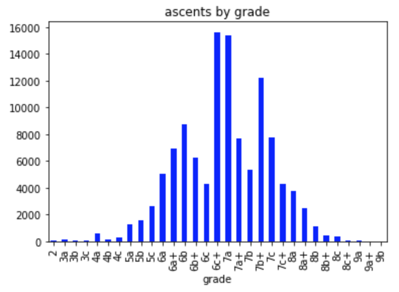
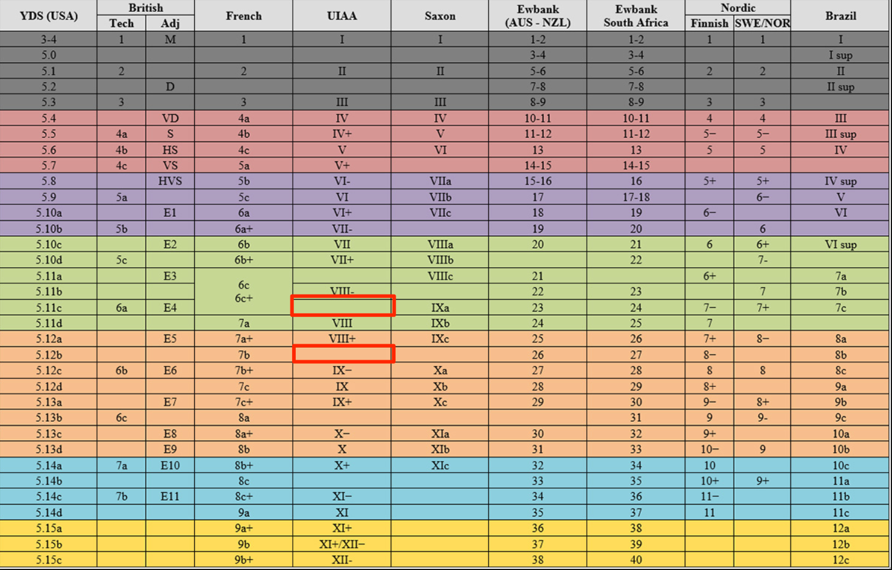
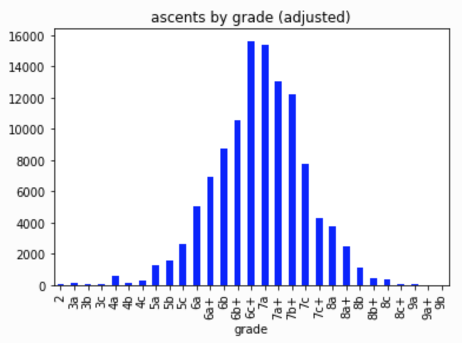
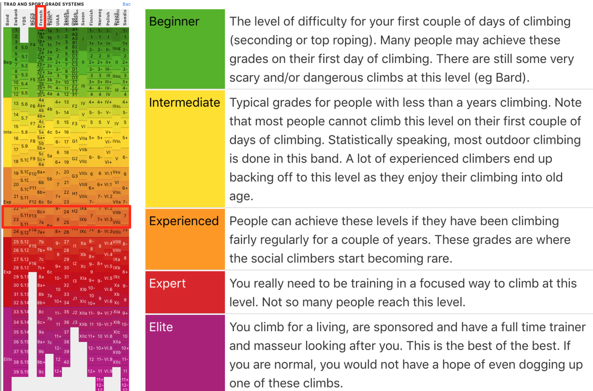
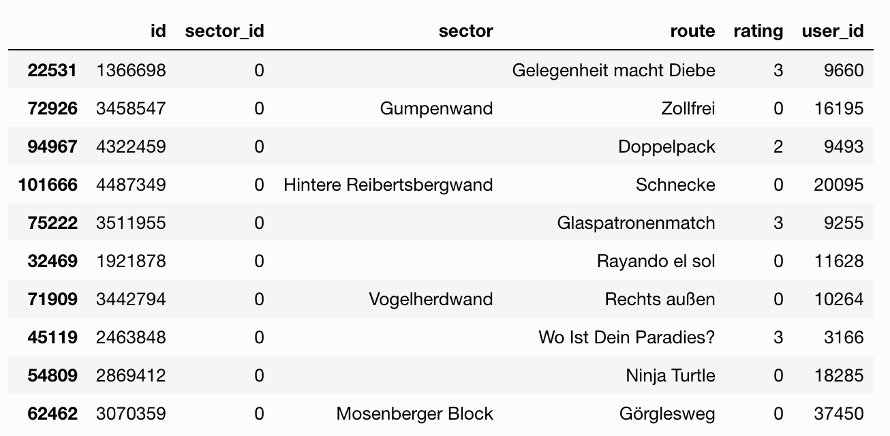
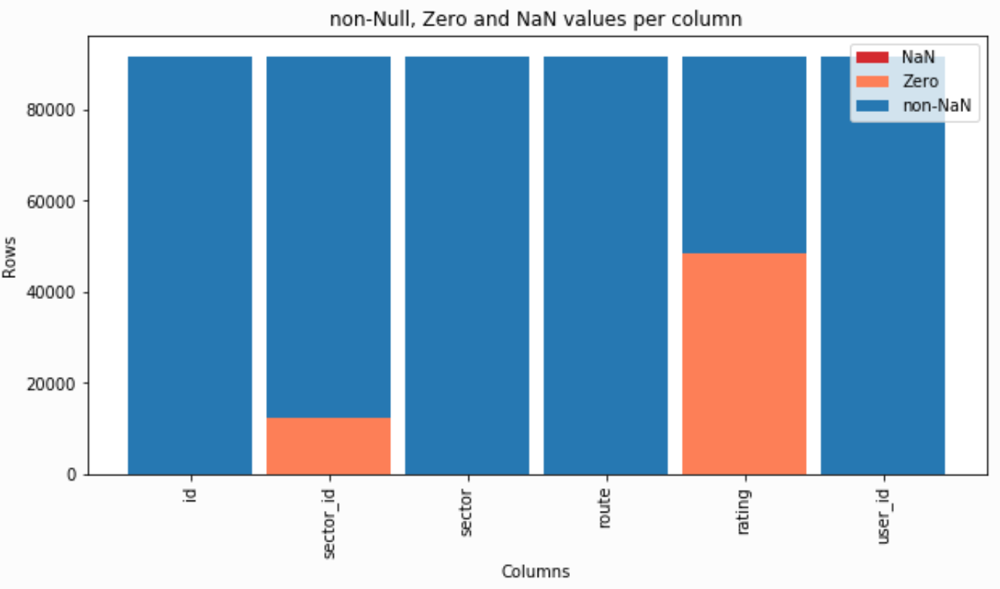
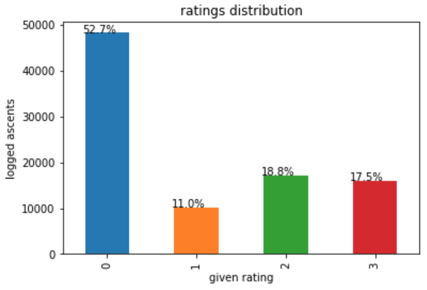

# Machine Learning Engineer Nanodegree
## Capstone Project
Dominik Lindenberger  
November, 2018

## I. Definition
_(approx. 1-2 pages)_

### Project Overview
The goal of this project is to build a recommender system for climbing routes within a given climbing area. The system will take a climbers preference and his or her stats into consideration.

My Capstone Project is located in the world of **rock climbing**.  
>_Rock climbing is an activity in which participants climb up, down or across natural rock formations or artificial rock walls. The goal is to reach the summit of a formation or the endpoint of a pre-defined route without falling._ [^first]  

Here is a video of a rock climber on a famous route called [Action Directe](https://www.youtube.com/watch?v=y3EJctYJzpk).

In recent years rock climbing has gained a lot of traction and is becoming more popular as an outdoor sports for a larger number of people. As such, there exists a potentially large audience  who could be interested in this project.

Unlike the climber from the video above most people do rock climbing as a leisure activity. Therefore, time they can spend to go climbing is limited. As a hobby climber planning a climbing trip it is quite common to have a time window of round about 1-3 weeks at the climbing destination of choice. The majority of climbing areas boast a large number of routes to climb, far greater than anyone can achieve within a single trip. For example, the climbing area 'Frankenjura', one of Germany's largest climbing area, contains more than 10,000 climbs. It is therefore in the interest of the climber to know and attempt those climbs that are most enjoyable to her or him and just skip the rest.

Often times there is a common agreement on what are the 'best' routes in a certain area and they are common knowledge. Most guide books contain some sort of list of the "Top climbs" in that region.    
However, climbers often differ in their personal preferences. Some prefer to climb on small crimpy holds, while others enjoy long dynamic movements on large holds.  
Additionally, for some type of rock, the climbs deteriorate over time as heavy traffic 'polishes' holds with formerly good and important friction.  

Therefore, climbers would benefit from a personal recommendation of the best climbs within a climbing area, that match their climbing level as well as their personal preference.

Meanwhile there are many websites where climbers can track their climbs and ascents in a virtual logbook and also rate the quality of the route. Most famous websites of this kind are

* [8a.nu](https://www.8a.nu/)
* [theCrag.com](https://www.thecrag.com/)
* [UKClimbing.com](https://www.ukclimbing.com/logbook/)

With this project, I will explore the database of 8a.nu - published on [Kaggle](https://www.kaggle.com/dcohen21/8anu-climbing-logbook) - to establish a personal recommendation system for climbers venturing into new climbing areas.  

There has been quite a lot of academic research on the topic of recommender systems as well. Here is a short excerpt of publications:

* Su and Khoshgoftaar provide a good introduction into CF in their article [A Survey of Collaborative Filtering Techniques](https://www.hindawi.com/journals/aai/2009/421425/)
* In their 2018 paper Christakopoulou and Karypis provide an overview of [Local Latent Space Models for Top-N Recommendation](http://glaros.dtc.umn.edu/gkhome/node/1225)

As I am an avid climber myself, this project is something I take a strong personal interest in.

[^first]: [What is Rock Climbing?](https://riverrockclimbing.com/new-climbers/what-is-rock-climbing/)

### Problem Statement

`start Udacity`  
In this section, you will want to clearly define the problem that you are trying to solve, including the strategy (outline of tasks) you will use to achieve the desired solution. You should also thoroughly discuss what the intended solution will be for this problem. Questions to ask yourself when writing this section:  
- _Is the problem statement clearly defined? Will the reader understand what you are expecting to solve?_  
- _Have you thoroughly discussed how you will attempt to solve the problem?_  
- _Is an anticipated solution clearly defined? Will the reader understand what results you are looking for?_  
`end Udacity`  

The structure of the problem is that of a **Ranking problem** or more precise a **Collaborative Filtering problem**, where we try to suggest climbs based on a climber's similarity to other climbers.  

We will try to measure similarity based on ratings given to a climbed route. Climbers who climbed the same routes and gave those routes similar ratings, might also agree in their opinion on routes they haven't climbed, yet.  

So, we'll try to cluster climbers that climbed similar routes and that gave similar ratings to those routes using K-Means. This is an *Unsupervised Learning* technique.

Once we have identified clusters of climbers with similar taste, we'll determine a cluster's most recommended routes based on ratings and number of ratings. This is a **user based collaborative filtering** technique. 

In order to give a climber a personal recommendation, we have to determine to which cluster he or she belongs and recommend the **top n routes** from the cluster's top recommended routes that he or she has not climbed yet.

Our anticipated solution will be:  
**For any given climber, we can provide a personal recommendation of *n* routes that he or she has not climbed before.**

The following tasks should get us there:  

1. Consolidation of climbing routes (major cleanup/prep work, because users make typos in route names which result in duplicate routes in the data set)
- Match climbers' recommendations with routes  
- Determine cluster size using *Silhouette Score*  
- Cluster climbers based on recommendations using *K-Means*.  
- Calculate *Weighted Rating* of every route for climber's cluster to receive an absolute ranking of all routes.  
- Recommend top *n* routes that climber has not climbed before.  


### Metrics
In this section, you will need to clearly define the metrics or calculations you will use to measure performance of a model or result in your project. These calculations and metrics should be justified based on the characteristics of the problem and problem domain. Questions to ask yourself when writing this section:
- _Are the metrics you’ve chosen to measure the performance of your models clearly discussed and defined?_
- _Have you provided reasonable justification for the metrics chosen based on the problem and solution?_

Basically, our problem is a ranking problem. We want to show the most attractive and suitable climbs to a user. However, we'll frame it as a rating prediction problem.  
Using different models we will predict ratings of so far unrated routes. For this purpose we will use **RMSE** as our evaluation metric.

The project model as well as all of the benchmark models can be evaluated using RMSE, thus making this metric the favorable choice.


## II. Analysis
_(approx. 2-4 pages)_

### Data Exploration
`start Udacity`  
In this section, you will be expected to analyze the data you are using for the problem. This data can either be in the form of a dataset (or datasets), input data (or input files), or even an environment. The type of data should be thoroughly described and, if possible, have basic statistics and information presented (such as discussion of input features or defining characteristics about the input or environment). Any abnormalities or interesting qualities about the data that may need to be addressed have been identified (such as features that need to be transformed or the possibility of outliers). Questions to ask yourself when writing this section:
- _If a dataset is present for this problem, have you thoroughly discussed certain features about the dataset? Has a data sample been provided to the reader?_
- _If a dataset is present for this problem, are statistics about the dataset calculated and reported? Have any relevant results from this calculation been discussed?_
- _If a dataset is **not** present for this problem, has discussion been made about the input space or input data for your problem?_
- _Are there any abnormalities or characteristics about the input space or dataset that need to be addressed? (categorical variables, missing values, outliers, etc.)_  
`end Udacity`  

The data set for this project was downloaded from Kaggle at  
[8anu climbing logbook](https://www.kaggle.com/dcohen21/8anu-climbing-logbook)

Here is an overview of the data contained in the data set.

| Column | Description | Datatype | Use | 
|:------ |:------ |:------:|:------:| 
| `crag_country` | 3-letter country code of the country where the crag is located. | categorical | no | 
| `crag_id` | Unique id for identifying each crag. | int | no | 
| `crag` | Name of the crag | text | no | 
| `sector_id` | Unique id for identifying each sector. | int | yes | 
| `sector` | Name of the sector. A sector is a specific area within a crag. | text | yes | 
| `route` | Name of the route the climber has climbed. | text | yes | 
| `grade_id` | Unique id for identifying each climbing grade. | int | statistics | 
| `grade` | Climbing grade given to that route as per the French grading system | categorical | statistics | 
| `year` | Year the route was climbed | int | statistics | 
| `date` | Date the route was climbed. The date format is number of seconds since 1970-01-01. | int | statistics | 
| `method_id` | Unique id for identifying each type of ascent. | int | statistics | 
| `method` | The type of ascent the climber made on that route. | categorical | statistics | 
| `notes` | Additional information the climber provided for this climb, e.g. Soft graded, i.e. fairly easy climb for the given grade | categorical | statistics | 
| `raw_notes` | Encoding of different notes and combination of notes | int | statistics | 
| `rating` | Rating given to the climb by this climber. This is our target attribute. | int | target | 
| `user_id` | Unique id for this climber. | int | yes | 
| `user_country` | 3-letter country code of the country where this climber is from. | categorical | statistics | 
| `user_city` | City where this climber is from | text | statistics | 
| `sex` | The climber's sex. 0 indicates male, 1 indicates female. | int | statistics | 
| `height` | The climber's height in cm | int | statistics | 
| `weight` | The climber's weight in kg | int | statistics | 
| `birthdate` | The climber's date of birth | date | statistics | 
| `started_climbing` | The year the climber started climbing. | int | statistics | 

In the table above the column `Use` indicated how we plan to use the given column.

- `target` - this is a target attribute.
- `yes` - this column will be used during exploration and analysis.
- `no` - not planned to use that column during analysis and exploration.
- `statistics` - this column will not be used for analysis but may be interesting later on to do user statistics etc.

Our dataset contains __114,587 logged climbs__. 60,303 out of these contain a rating. That is approx. 52.63%.

Let's look at the distribution of routes by climbing grade (= difficulty level of the route) to understand whether our climbers are mostly beginners, advanced or professionals.



Our distribution seems to have the general form of a bell shape, i.e. a Gaussian distribution. What seems odd though, are the two dents in the distribution at 6c and 7b.

For this to understand we need to have some background knowledge on the different climbing grading systems used in different countries. The grading system used by 8a.nu, which is the source of our data set, is the _French_ grading system. In Germany a different grading system is used called _UIAA_.

One peculiar thing about different grading systems is, that they do not follow the same step size. E.g. in French scale grading the step from one grade to the next higher grade could be smaller than the steps in between grades in UIAA. This can be seen when looking at a grade comparison chart as shown below.



All the route in Germany are given grades following UIAA scale. If a climber wants to log a climb in Germany with a UIAA grade on 8a.nu, he has to convert the grade to French scale. As there are no real corresponding entries for 6c and 7b in the UIAA scale, this explains the dent in our distribution.

Therefore, joining the numbers from 6c and 6b+, as well as 7a+ and 7b seems reasonable. 



And the result of the distribution of logged climbs is now as expected.

With the majority of climbs around 6c+, 7a level, what does this actually mean? Let's take a look at the assessment given by the website [thecrag.com](https://www.thecrag.com/en/article/grades#grade-ranges). And we can see that the majority of logged ascents are in the upper _Experienced_ range.



#### Missing values

Let us take a look if we have **missing values** or **zero values**.

Number of missing values per column:

```
id           0
sector_id    0
sector       0
route        0
rating       0
user_id      0
dtype: int64
```
This means there are no entries missing in the columns that we look at.

Number of zero values per column:

```
id               0
sector_id    12301
sector           0
route            0
rating       48291
user_id          0
dtype: int64
```
However, there a quite a significant amount of sector_IDs missing and also a lot of ratings.

#### Unique values
A naive calculation on the number of unique sectors and routes within these sectors. Submitted by a number of distinct users.

```
sector_id      350
route        12471
user_id       3292
dtype: int64
```
Why do we call the above estimate _naive_? 

According to [climb-europe.com](http://www.climb-europe.com/RockClimbingGermany/RockClimbingFrankenjura.html) _"there are approximately 1,000 crags spread out in a beautiful forest terrain"_ (Note that _crags_ in the above quote is the same as _sectors_ in our dataset.) This seems fine since in our dataset there are 351 different sectors noted.

In the article it continues to claim that _Frankenjura boasts in excess of 10,000 routes._ Now this is where we should get a little suspicious. In only 350 sectors our dataset apparently contains already more than 12,000 routes - which is well above the 10,000 mentioned in the article.

Lets dig deeper here.

What are the records where `sector_id` is 0?  
We take a look at a number of samples.




### Exploratory Visualization
`start Udacity`  
In this section, you will need to provide some form of visualization that summarizes or extracts a relevant characteristic or feature about the data. The visualization should adequately support the data being used. Discuss why this visualization was chosen and how it is relevant. Questions to ask yourself when writing this section:  
- _Have you visualized a relevant characteristic or feature about the dataset or input data?_  
- _Is the visualization thoroughly analyzed and discussed?_  
- _If a plot is provided, are the axes, title, and datum clearly defined?_  
`end Udacity`  

#### Missing values

Lets visualize the **Missing** and **Zero values** per column.



In our data set `0` is in indicator for missing values, except for `sex` where `0` indicates `male` (and `1` for `female`).

From the graph above we can conclude that we have missing data in `sector_id` and `rating`.

Since `sector_id` and `rating` are important for our analysis, we have to consider what to do about those missing values during Data Preparation later on.

#### Analysis of our target variable `rating`



From the distribution of the target variable `rating`, we can see that there are four distinct values. With 52.7% of ratings equal to 0, only about half of the ascents have been rated.

In the climbing community it is commonplace to rate only good climbs by marking them with a star. Thus, the values `1`, `2` or `3` correspond to one, two or three stars. Where one star is a good route and three stars is an exceptional good climb.

Hence the value `0`, or zero stars, denotes that a climb was either not rated or was not worth a star according to that used.

### Algorithms and Techniques
In this section, you will need to discuss the algorithms and techniques you intend to use for solving the problem. You should justify the use of each one based on the characteristics of the problem and the problem domain. Questions to ask yourself when writing this section:
- _Are the algorithms you will use, including any default variables/parameters in the project clearly defined?_
- _Are the techniques to be used thoroughly discussed and justified?_
- _Is it made clear how the input data or datasets will be handled by the algorithms and techniques chosen?_

### Benchmark
In this section, you will need to provide a clearly defined benchmark result or threshold for comparing across performances obtained by your solution. The reasoning behind the benchmark (in the case where it is not an established result) should be discussed. Questions to ask yourself when writing this section:
- _Has some result or value been provided that acts as a benchmark for measuring performance?_
- _Is it clear how this result or value was obtained (whether by data or by hypothesis)?_


## III. Methodology
_(approx. 3-5 pages)_

### Data Preprocessing
In this section, all of your preprocessing steps will need to be clearly documented, if any were necessary. From the previous section, any of the abnormalities or characteristics that you identified about the dataset will be addressed and corrected here. Questions to ask yourself when writing this section:
- _If the algorithms chosen require preprocessing steps like feature selection or feature transformations, have they been properly documented?_
- _Based on the **Data Exploration** section, if there were abnormalities or characteristics that needed to be addressed, have they been properly corrected?_
- _If no preprocessing is needed, has it been made clear why?_

### Implementation
In this section, the process for which metrics, algorithms, and techniques that you implemented for the given data will need to be clearly documented. It should be abundantly clear how the implementation was carried out, and discussion should be made regarding any complications that occurred during this process. Questions to ask yourself when writing this section:
- _Is it made clear how the algorithms and techniques were implemented with the given datasets or input data?_
- _Were there any complications with the original metrics or techniques that required changing prior to acquiring a solution?_
- _Was there any part of the coding process (e.g., writing complicated functions) that should be documented?_

### Refinement
In this section, you will need to discuss the process of improvement you made upon the algorithms and techniques you used in your implementation. For example, adjusting parameters for certain models to acquire improved solutions would fall under the refinement category. Your initial and final solutions should be reported, as well as any significant intermediate results as necessary. Questions to ask yourself when writing this section:
- _Has an initial solution been found and clearly reported?_
- _Is the process of improvement clearly documented, such as what techniques were used?_
- _Are intermediate and final solutions clearly reported as the process is improved?_


## IV. Results
_(approx. 2-3 pages)_

### Model Evaluation and Validation
In this section, the final model and any supporting qualities should be evaluated in detail. It should be clear how the final model was derived and why this model was chosen. In addition, some type of analysis should be used to validate the robustness of this model and its solution, such as manipulating the input data or environment to see how the model’s solution is affected (this is called sensitivity analysis). Questions to ask yourself when writing this section:
- _Is the final model reasonable and aligning with solution expectations? Are the final parameters of the model appropriate?_
- _Has the final model been tested with various inputs to evaluate whether the model generalizes well to unseen data?_
- _Is the model robust enough for the problem? Do small perturbations (changes) in training data or the input space greatly affect the results?_
- _Can results found from the model be trusted?_

### Justification
In this section, your model’s final solution and its results should be compared to the benchmark you established earlier in the project using some type of statistical analysis. You should also justify whether these results and the solution are significant enough to have solved the problem posed in the project. Questions to ask yourself when writing this section:
- _Are the final results found stronger than the benchmark result reported earlier?_
- _Have you thoroughly analyzed and discussed the final solution?_
- _Is the final solution significant enough to have solved the problem?_


## V. Conclusion
_(approx. 1-2 pages)_

### Free-Form Visualization
In this section, you will need to provide some form of visualization that emphasizes an important quality about the project. It is much more free-form, but should reasonably support a significant result or characteristic about the problem that you want to discuss. Questions to ask yourself when writing this section:
- _Have you visualized a relevant or important quality about the problem, dataset, input data, or results?_
- _Is the visualization thoroughly analyzed and discussed?_
- _If a plot is provided, are the axes, title, and datum clearly defined?_

### Reflection
In this section, you will summarize the entire end-to-end problem solution and discuss one or two particular aspects of the project you found interesting or difficult. You are expected to reflect on the project as a whole to show that you have a firm understanding of the entire process employed in your work. Questions to ask yourself when writing this section:
- _Have you thoroughly summarized the entire process you used for this project?_
- _Were there any interesting aspects of the project?_
- _Were there any difficult aspects of the project?_
- _Does the final model and solution fit your expectations for the problem, and should it be used in a general setting to solve these types of problems?_

### Improvement
In this section, you will need to provide discussion as to how one aspect of the implementation you designed could be improved. As an example, consider ways your implementation can be made more general, and what would need to be modified. You do not need to make this improvement, but the potential solutions resulting from these changes are considered and compared/contrasted to your current solution. Questions to ask yourself when writing this section:
- _Are there further improvements that could be made on the algorithms or techniques you used in this project?_
- _Were there algorithms or techniques you researched that you did not know how to implement, but would consider using if you knew how?_
- _If you used your final solution as the new benchmark, do you think an even better solution exists?_

-----------

**Before submitting, ask yourself. . .**

- Does the project report you’ve written follow a well-organized structure similar to that of the project template?
- Is each section (particularly **Analysis** and **Methodology**) written in a clear, concise and specific fashion? Are there any ambiguous terms or phrases that need clarification?
- Would the intended audience of your project be able to understand your analysis, methods, and results?
- Have you properly proof-read your project report to assure there are minimal grammatical and spelling mistakes?
- Are all the resources used for this project correctly cited and referenced?
- Is the code that implements your solution easily readable and properly commented?
- Does the code execute without error and produce results similar to those reported?
